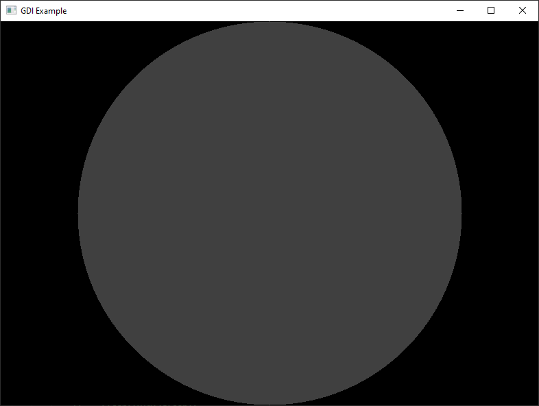

## GDI Example

An example of GDI rendering:
1. `Window.cxx` - window mode.

### Build
Configure the build:
1. Enable Unicode support.

### Visual

### See Also
1. [DirectDraw Example](https://github.com/EugeneKirian/DirectDrawExample)
